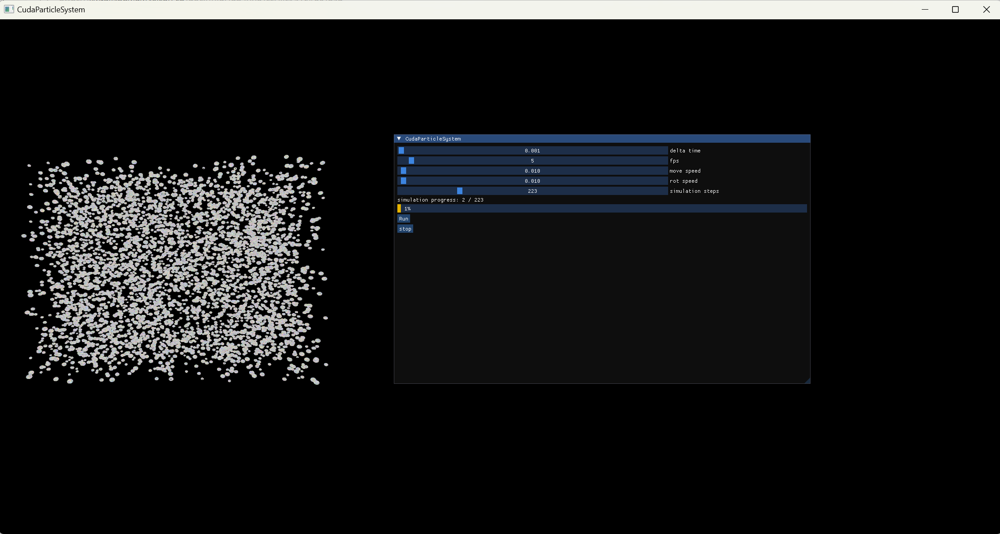

# CudaParticleSystem

## Introduction

CudaParticleSystem is a high-performance particle system simulation framework leveraging CUDA for parallel computation.

It supports various force fields, such as gravity and whirlwind fields, to simulate realistic particle dynamics in a 3D space. It is designed to be extensible, enabling users to implement custom force fields and integrate them into the system easily.

The framework features tiled-based rasterization(TBR) for efficient rendering, allowing for optimized graphics performance. 

<div style="text-align:center;">

</div>

## Get Started
### Prerequisites
* CUDA Toolkit: Ensure you have the latest version of the CUDA Toolkit installed.
* CMake: For building the project.

### Installation
#### Clone the repository
```shell
git clone https://github.com/guomc9/CudaParticleSystem.git
cd CudaParticleSystem
```
#### Build the project
```shell
mkdir build
cd build
cmake ..
make
```
#### Run
```shell
./CudaParticleSystem
```

## Custom Force Field
### Interface
```cpp
// From include/field.hpp
class Field
{
    __device__ virtual float3 get_force(const Particle* p) const = 0;
};
```
### Implemetation Examples
#### Whirlwind Field
##### Radial force
$$
F_r = -\frac{\mathrm{d}P}{\mathrm{d}r}\cdot A
$$
##### Axial force
$$
F_z = ma_z
$$
##### Tangential force
$$
F_\tau = m\cdot \omega^2 \cdot r
$$
##### Parameters
$m$ : Mass of a particle.

$r$ : Radial distance from whirlwind center to particle.

$A$ : Force area of particle, assume that $A=\pi\cdot R^2$, $R$ is the radius of a particle.

$\frac{\mathrm{d}P}{\mathrm{d}r}$ : Pressure gradient, assume that $\frac{\mathrm{d}P}{\mathrm{d}r}=-2\alpha rP_0e^{-2\alpha r^2}$, $\alpha$ and $P_0$ is a constant.

$a_z$ : Axial acceleration, assume that $a_z=\beta\cdot e^{-\lambda |z|}$, $\beta$ is a constant.

$\omega$ : Angular velocity, assume that $\omega$ is a constant.

##### Implementation
```cpp
// From include/fields/whirlwind_fileld.hpp

class WhirlWindField : Field
{
    public:
        __device__ float3 get_force(const Particle* p) const override
        {
            const float3 center {0, 0, 0};
            const float P0 = 1000.0f;
            const float alpha = 0.0001f;
            const float beta = 20.0f;
            const float lambda = 0.2f;
            const float omega = 15.0f;
            float3 force {0, 0, 0};
            const float3 pos = p->get_position();
            float3 r = {center.x - pos.x, center.y - pos.y, 0};
            float r_norm = sqrt(r.x * r.x + r.y * r.y);
            r.x /= r_norm;
            r.y /= r_norm;
            float radius = p->get_radius();
            float f_r = r_norm * P0 * expf(-2 * alpha * r_norm * r_norm) * 3.14f * radius * radius;
            float3 F_r {f_r * r.x / r_norm, f_r * r.y / r_norm, 0};
            
            float3 a {0, 0, 1};
            float3 F_z {0, 0, p->get_mass() * beta * expf(-lambda * fabsf(pos.z))};

            float3 t = {r.y, -r.x, 0};
            float f_t = p->get_mass() * omega * omega * r_norm;
            float3 F_t {t.x * f_t, t.y * f_t, 0};

            return float3{F_r.x + F_t.x, F_r.y + F_t.y, F_r.z + F_t.z + F_z.z};
        }
};
```

#### Gravity Field
##### Axial force
$$
F_z = -mg
$$
##### Implementation
```cpp
// From include\fields\gravity_field.hpp
class GravityField : Field
{
    public:
        __device__ float3 get_force(const Particle* p) const override
        {
            const float g = 10.0f;
            float3 force{0.0f, -p->get_mass() * g, 0.f};
            return force;
        }
};

```

